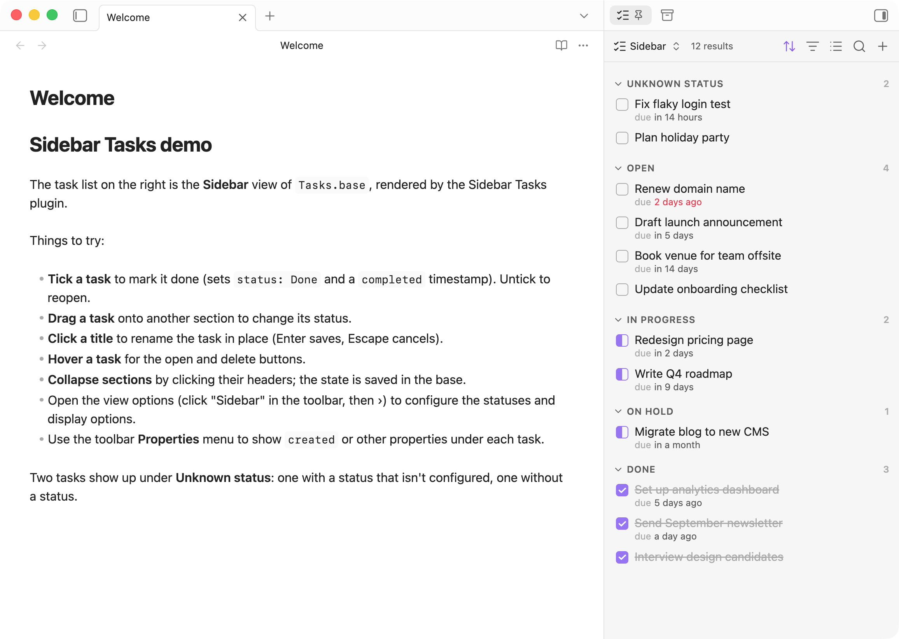

# Sidebar Tasks

A **Task list** view for [Bases](https://help.obsidian.md/bases), designed to sit in the sidebar so your tasks are always visible.

Each note in the base is a task. Its status lives in a frontmatter property (`status` by default).

## Features

- **Checkboxes that match the status:** empty for open, half-filled for in progress, ticked for done. Ticking a task sets the first done status and records a `completed` timestamp. Unticking sets the first open status.
- **Drag and drop** a task onto another section to change its status (when the view is grouped by status).
- **Inline rename:** click a title to rename the note. Links to it are updated.
- **Open and delete buttons** appear when you hover a task. Deleted tasks go to the trash set in Obsidian's "Deleted files" setting.
- **Collapsible sections:** collapsed state is saved in the base, and empty sections collapse automatically.
- **Unknown status section** at the top for tasks with no status or a status that isn't configured.
- **Due dates** are shown relative ("in 3 days") or absolute, and highlighted when overdue.
- **Any property** can be shown under a task. Links open their note, and folder links reveal the folder in the file explorer.

## Getting started

1. Create a base that filters your task notes, for example `file.inFolder("Tasks")`.
2. Add a view and choose the **Task list** layout.
3. Group the view by your status property.
4. With the base open, run **Sidebar Tasks: Open current base in right sidebar** from the command palette. Obsidian remembers the sidebar layout from then on.

## View options

Open the view options from the base toolbar (click the view name, then ›).

**Display**

| Option | Description |
|---|---|
| Hide done tasks | Hide tasks with a done status. |
| Keep empty groups | Show a section for every configured status, even with no tasks, so you can drop tasks into it. |
| Show property names | Prefix each property with its name, e.g. "due in 3 days". |
| Dates | Relative or absolute dates. |

**Task status**

| Option | Default | Description |
|---|---|---|
| Status property | `status` | Frontmatter property holding the status. |
| Open statuses | `To do` | Shown as an empty checkbox. The first one is used when reopening a task. |
| In progress statuses | `In progress` | Shown as a half-filled checkbox. |
| Done statuses | `Done` | Shown ticked. The first one is used when completing a task. |
| Completed date property | `completed` | Set when a task is completed, removed when it's reopened. |

When grouped by status, sections follow the order of these lists. To choose which properties appear under each task, use the toolbar's **Properties** menu.

## Installation

From Obsidian: **Settings → Community plugins → Browse**, then search for "Sidebar Tasks".

Manually: copy `main.js`, `manifest.json` and `styles.css` into `<vault>/.obsidian/plugins/sidebar-tasks/`, then enable the plugin.

Requires Obsidian 1.10.0 or later.
